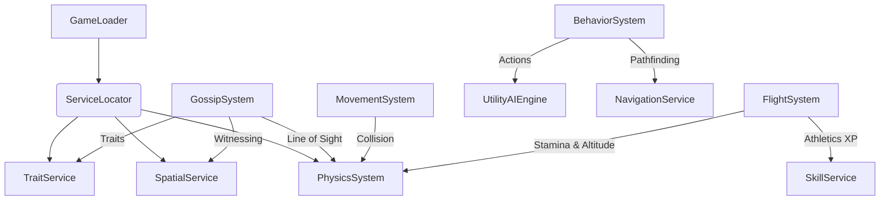

# Systems Overview

This document provides a high-level overview of the Yukkuri Game's systems, how they are initialized, and how they interact.

## usage
The `GameLoader` (`game/loader.py`) is responsible for wiring up all services and systems. It follows this order:
1.  **Service Registration**: Core services (Audio, Physics, EventBus) are registered first.
2.  **Global State injection**: Economy, Time, and Input services are initialized.
3.  **System Registration**: Game logic systems (Hunger, Social, etc.) are added to the ECS World.

## System Dependency Graph

Most systems operate independently via the ECS and Event Bus, but some have explicit dependencies.

## Key Systems

### 1. Social & Gossip (`GossipSystem`, `SocialSystem`)
- **GossipSystem**: Handles the "hearing" and transmission of information. Uses `SpatialService` to efficiently find nearby witnesses to events.
- **SocialSystem**: Manages relationships and social stats (happiness, bonding).

### 2. Biological (`HungerSystem`, `PoopSystem`, `Lifecycle`)
- **HungerSystem**: Decreases hunger over time. Low hunger affects health and happiness.
- **PoopSystem**: Generates waste entities when the bladder is full.
- **Lifecycle**: Handles aging and growth stages (Baby -> Child -> Adult).

### 3. Physics & Movement (`PhysicsSystem`, `KinematicMovementSystem`, `FlightSystem`)
- **PhysicsSystem**: Wraps `pymunk`. Handles collision detection and resolution.
- **KinematicMovementSystem**: Applies forces to entities to move them towards targets.
- **FlightSystem**: Manages flight mechanics for flying Yukkuris.
  - Handles **Stamina** drain (Fly/Hover cost) and recovery (Grounded).
  - Manages **Altitude** transitions (Takeoff, Flying, Landing).
  - Integrates with **SkillService** to award Athletics XP.

### 4. AI & Behavior (`BehaviorSystem`)
- **BehaviorSystem**: The "brain" of the entities.
- Uses **Utility AI** to score interactions based on `GoalComponent`.
- Executes **Behavior Trees** for complex actions.

## Adding a New System

1.  **Create the System**: Inherit from `System` (in `engine.ecs`). Be sure to implement `update(self, world, dt)`.
2.  **Register it**: Add it to `SystemRegistry.register_systems` in `src/yukkuri_game/system_registry.py` (or `game/loader.py` if manual).
3.  **Dependencies**: If your system needs a service (like Physics), access it via `world.services.get(PhysicsSystem)`. Use `try_get` in `update` for lazy loading if needed to avoid circular import issues during init.
