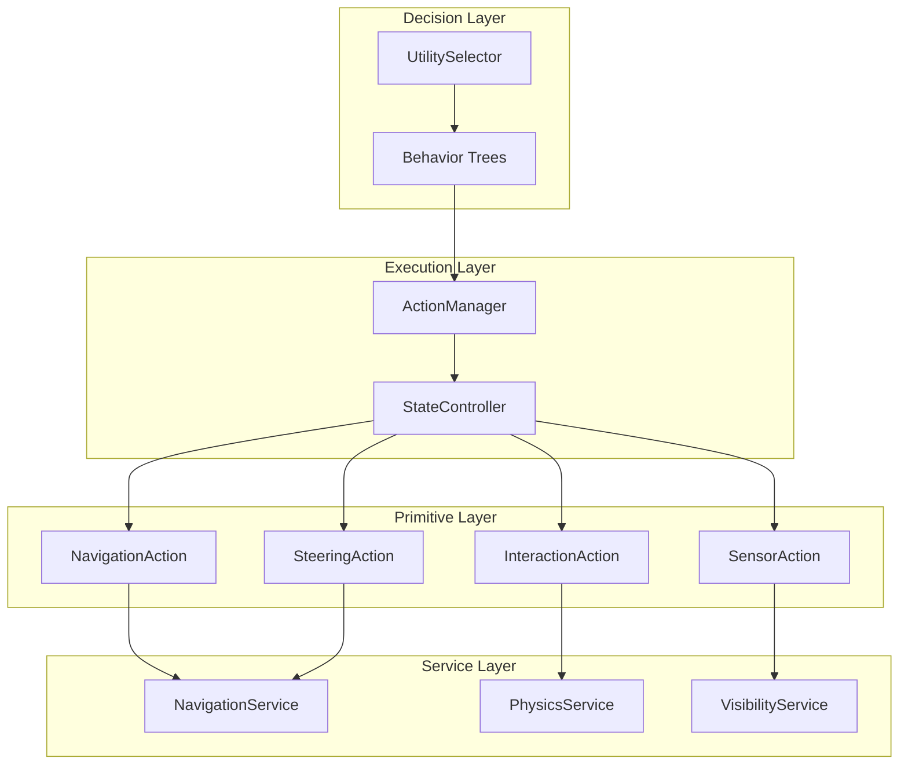
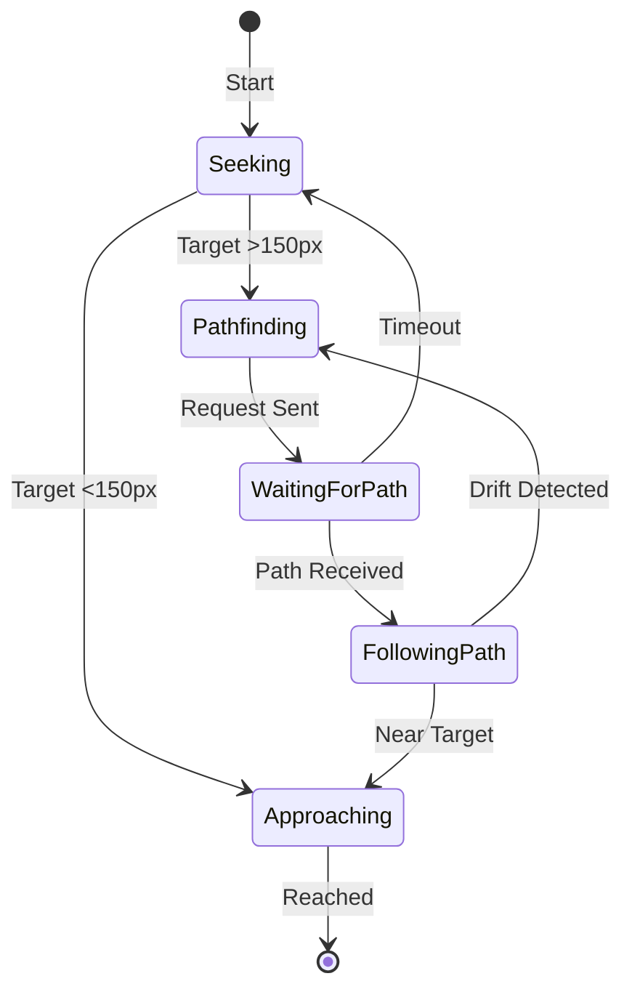

# AI System Rewrite Proposal

## Problem Statement

The current AI system suffers from several architectural issues that lead to strange bugs and edge cases:

### Current Issues Identified

1. **Monolithic Action Classes**: `MoveToTarget` is ~240 lines handling direct steering, pathfinding, timeouts, drift detection, line-of-sight checks, and flight integration—all in a single `update()` method.

2. **Duplicated Logic**: Classes like `FindPrey` and `EatPrey` appear twice in `behavior.py` (lines 1437-1600 and 1661-1817) with slightly different implementations.

3. **Hardcoded Constants**: Magic numbers scattered throughout (`0.5` timeout, `150.0` close-range, `50.0` drift threshold, `0.016` dt approximation).

4. **State Management in Components**: `AIState.state_data` is a catch-all dictionary storing path requests, timestamps, failure flags, and last-known positions without type safety or validation.

5. **Tight Coupling**: Actions directly access physics systems, navigation services, and multiple component types, making them difficult to test in isolation.

6. **Inconsistent Return Semantics**: `FleePredator` returns `FAILURE` when safe (to let selector continue), which is counterintuitive and requires comments to explain.

7. **No Delta Time Injection**: Actions hardcode `dt = 0.016` instead of receiving it from the behavior tree tick.

---

## Proposed Architecture

### Core Principles

| Principle | Description |
|-----------|-------------|
| **Single Responsibility** | Each action handles ONE thing well |
| **Data-Driven Configuration** | Move magic numbers to configuration files |
| **Explicit State Machines** | Replace `state_data` dict with typed state objects |
| **Dependency Injection** | Actions receive services, not fetch them |
| **Consistent Semantics** | Standardize return value meanings across all actions |

### Layered Architecture



---

## Component Breakdown

### 1. ActionContext (Replacing state_data)

```python
@dataclass
class ActionContext:
    """Typed container for action execution state."""
    entity_id: EntityID
    delta_time: float
    services: ServiceLocator
    
    # Navigation State
    path_request_id: Optional[int] = None
    path_request_time: float = 0.0
    last_known_target_pos: Optional[Vec2d] = None
    
    # Predation State  
    eating_progress: float = 0.0
    eating_target_id: Optional[EntityID] = None
```

### 2. Primitive Actions

| Action | Responsibility | Inputs | Outputs |
|--------|---------------|--------|---------|
| `SeekPosition` | Move toward coordinates | target_pos, speed | target_velocity |
| `FollowPath` | Follow waypoint list | path, speed | target_velocity |
| `CheckLineOfSight` | Raycast to target | target_id | bool |
| `RequestPath` | Initiate async pathfinding | start, goal | request_id |
| `ApplyDamage` | Deal damage over time | target_id, dps | bool (killed?) |

### 3. Composite Actions (Built from Primitives)

**MoveToTarget** becomes:
```
Sequence:
├─ Selector (Path Strategy):
│   ├─ Sequence (Direct Pursuit):
│   │   ├─ CheckLineOfSight
│   │   ├─ CheckDistance(< 150px) OR CheckDistance(< 400px)
│   │   └─ SeekPosition
│   └─ Sequence (Pathfinding):
│       ├─ RequestPath (if needed)
│       ├─ WaitForPath (with timeout)
│       └─ FollowPath
└─ Parallel (Drift Detection):
    └─ CheckTargetDrift → Invalidate Path
```

### 4. Configuration System

Move constants to `ai_config.toml`:

```toml
[navigation]
close_range_threshold = 150.0
medium_range_threshold = 400.0
path_request_timeout = 0.5
drift_threshold_base = 50.0
drift_cooldown = 0.5

[combat]
eating_range = 40.0
rescue_radius = 60.0
flee_start_distance = 200.0

[movement]
default_speed = 100.0
flee_speed = 150.0
low_energy_speed_modifier = 0.5
low_energy_threshold = 30.0
```

### 5. State Machine for Complex Actions



---

## Benefits

| Aspect | Before | After |
|--------|--------|-------|
| **Testability** | Actions require full World setup | Primitives can be unit tested with mocks |
| **Debugging** | One 240-line method | Clear state transitions logged |
| **Configurability** | Hardcoded values | Data-driven tuning |
| **Extensibility** | Copy-paste patterns | Compose new behaviors from primitives |
| **Type Safety** | Any dict for state | Typed ActionContext |

---

## Compatibility Strategy

1. **Facade Pattern**: New system exposes same `MoveToTarget`, `FindPrey`, etc. API
2. **Gradual Migration**: Convert one action at a time, tests validate equivalence
3. **Feature Flag**: `AI_USE_NEW_SYSTEM` toggle during transition

---

## Risk Mitigation

| Risk | Mitigation |
|------|------------|
| Regression bugs | Comprehensive test suite before/after |
| Performance overhead | Profile primitive dispatch cost |
| Learning curve | Clear documentation with examples |
| Scope creep | Strict phase boundaries |
