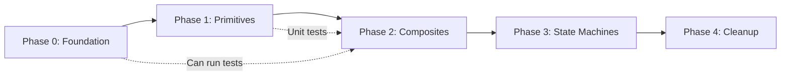

# AI System Rewrite - Implementation Tasks

## Phase 0: Foundation (No Breaking Changes)

### 0.1 Configuration System
- [ ] Create `src/yukkuri_game/data/ai_config.toml` with extracted constants
- [ ] Create `AIConfig` dataclass to load and validate config
- [ ] Register `AIConfig` as a world service
- [ ] Update existing actions to read from config (keep hardcoded as fallback)

### 0.2 ActionContext Infrastructure
- [ ] Create `src/yukkuri_game/game/ai/action_context.py`
  - [ ] Define `ActionContext` dataclass with typed navigation state
  - [ ] Define `CombatContext` dataclass for predation state
  - [ ] Add `ContextManager` class to create/retrieve contexts per entity
- [ ] Add `ActionContext` component to entity creation (optional, for opt-in)
- [ ] Migrate `AIState.state_data` usage to `ActionContext` in one pilot action

### 0.3 Refactor Duplicated Code
- [ ] Remove duplicate `FindPrey` class (keep lines 1661-1731, delete 1437-1500)
- [ ] Remove duplicate `EatPrey` class (keep lines 1734-1817, delete 1503-1600)
- [ ] Ensure `build_hunt_behavior` uses the canonical versions
- [ ] Run existing tests to validate no regression

---

## Phase 1: Primitive Actions

### 1.1 Create Primitive Action Base
- [ ] Create `src/yukkuri_game/game/ai/primitives/__init__.py`
- [ ] Create `PrimitiveAction` base class with:
  - [ ] `ActionContext` injection
  - [ ] Standard logging interface
  - [ ] Performance timing hooks

### 1.2 Movement Primitives
- [ ] `SeekPosition`: Direct velocity toward target coordinates
  - [ ] Input: target_pos (Vec2d), speed (float)
  - [ ] Output: Sets `MovementController.target_velocity`
  - [ ] Unit test: Verify velocity direction and magnitude
  
- [ ] `FollowPath`: Consume waypoints from path list
  - [ ] Input: path (list[Vec2d]), speed (float)
  - [ ] Output: Sets velocity toward current waypoint, advances when reached
  - [ ] Unit test: Verify waypoint advancement

- [ ] `StopMovement`: Zero out velocity
  - [ ] Unit test: Verify velocity becomes zero

### 1.3 Sensing Primitives
- [ ] `CheckLineOfSight`: Raycast between entity and target
  - [ ] Input: target_id
  - [ ] Output: bool (clear LOS?)
  - [ ] Unit test: Mock physics space, verify raycast call

- [ ] `CheckDistance`: Measure distance to target
  - [ ] Input: target_id, threshold
  - [ ] Output: bool (within threshold?)
  - [ ] Unit test: Various distance scenarios

- [ ] `FindNearestByComponent`: Generic entity search
  - [ ] Input: component_type, max_range, filter_fn
  - [ ] Output: EntityID or -1
  - [ ] Unit test: Multiple entities, sorting

### 1.4 Navigation Primitives
- [ ] `RequestPath`: Submit async path request
  - [ ] Input: start, goal, capabilities, priority
  - [ ] Output: Stores request_id in ActionContext
  - [ ] Unit test: Verify NavigationService called

- [ ] `CheckPathReady`: Poll for path completion
  - [ ] Input: request_id
  - [ ] Output: `RUNNING` while waiting, `SUCCESS` when ready, `FAILURE` on timeout
  - [ ] Unit test: Mock callback

- [ ] `InvalidatePath`: Clear current path (for drift detection)
  - [ ] Unit test: Verify path cleared

### 1.5 Combat Primitives
- [ ] `ApplyDamageOverTime`: Channel damage to target
  - [ ] Input: target_id, dps, dt
  - [ ] Output: `SUCCESS` when target dies, `RUNNING` otherwise
  - [ ] Unit test: Verify correct damage application

- [ ] `CheckNearbyDefenders`: Social defense check
  - [ ] Input: target_id, rescue_radius
  - [ ] Output: bool (defender present?)
  - [ ] Unit test: Various defender scenarios

---

## Phase 2: Composite Actions

### 2.1 Refactor MoveToTarget
- [ ] Create `MoveToTargetV2` using primitive composition:
  ```
  Selector:
  ├─ DirectPursuit (primitives: CheckLOS, CheckDistance, SeekPosition)
  └─ PathfindingPursuit (primitives: RequestPath, CheckPathReady, FollowPath)
  ```
- [ ] Add drift detection decorator
- [ ] Add timeout handling
- [ ] Integration test: Compare behavior to original MoveToTarget
- [ ] Feature flag: `use_move_to_target_v2`

### 2.2 Refactor Hunt Behavior
- [ ] Create `HuntBehaviorV2`:
  ```
  Sequence:
  ├─ FindNearestByComponent(Needs, with prey_tags filter)
  ├─ MoveToTargetV2
  ├─ CheckNearbyDefenders (guard)
  └─ ApplyDamageOverTime
  ```
- [ ] Integration test: Predator successfully hunts prey
- [ ] Integration test: Hunt interrupted by defender

### 2.3 Refactor Flee Behavior
- [ ] Create `FleeV2` with consistent return semantics:
  - [ ] `RUNNING` when fleeing
  - [ ] `SUCCESS` when safe distance reached
  - [ ] `FAILURE` on error
- [ ] Update behavior tree to use Inverter if needed for selector logic

---

## Phase 3: State Machine Integration

### 3.1 Action State Machine
- [ ] Create `ActionStateMachine` class
- [ ] Define states: `IDLE`, `SEEKING`, `PATHFINDING`, `WAITING`, `EXECUTING`, `COMPLETE`
- [ ] Add state transition logging
- [ ] Visualizer debug tool (optional)

### 3.2 Apply to Complex Actions
- [ ] Refactor `EatPrey` to use state machine:
  - [ ] `APPROACHING` → `CHANNELING` → `CONSUMING`
- [ ] Add state persistence across ticks

---

## Phase 4: Cleanup & Documentation

### 4.1 Code Cleanup
- [ ] Remove old action implementations after V2 validation
- [ ] Remove feature flags
- [ ] Update all `build_*_behavior` functions to use new primitives

### 4.2 Documentation
- [ ] Update AI architecture docs
- [ ] Add "How to create a new behavior" guide
- [ ] Document configuration options

### 4.3 Performance Validation
- [ ] Benchmark: 100 entities AI tick time (before/after)
- [ ] Profile primitive dispatch overhead
- [ ] Optimize if regression > 10%

---

## Dependencies Between Phases



---

## Testing Strategy

| Phase | Test Type | Criteria |
|-------|-----------|----------|
| 0 | Unit | Config loading, context creation |
| 1 | Unit | Each primitive in isolation |
| 2 | Integration | Composed behavior matches original |
| 3 | Integration | State transitions correct |
| 4 | Regression | Full test suite passes |
| 4 | Performance | No > 10% regression |

### Existing Tests to Validate Against
- `tests/ai/test_predator_behavior.py`
- `tests/ai/test_predator_moving_target.py`
- `tests/ai/test_movetotarget_repaths_on_drift.py`
- `tests/ai/test_adaptive_drift_threshold.py`
- `tests/ai/test_navigation_integration.py`
