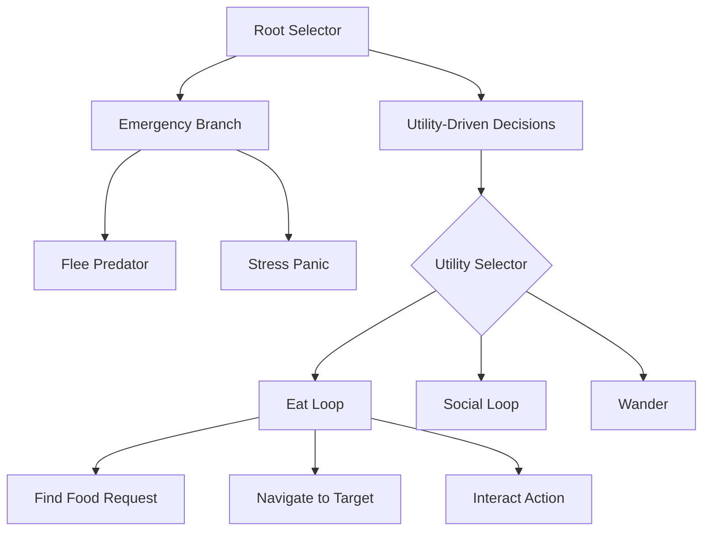

# Proposal 3: Modular AI 2.0 - Robust & Performant AI Rewrite

## 1. Problem Statement
The current AI system is a hybrid Behavior Tree (BT) and Utility AI implementation that, while functional, suffers from several structural issues leading to "strange bugs" and performance bottlenecks:

*   **Redundant Logic:** Perception/sensing logic is duplicated across BT actions and the Utility Selector.
*   **"God Actions":** Nodes like `MoveToTarget` handle too many responsibilities (pathfinding, drift detection, direct steering, LOS checks), making them fragile and hard to debug.
*   **Deep Coupling:** Actions like `Wander` create and manage their own internal `MoveToTarget` instances, bypassing the tree's orchestration.
*   **Vague State Management:** Reliance on a loosely structured `state_data` dictionary and `AIState` component leads to race conditions and hard-to-trace state changes during interruptions.
*   **Performance Overhead:** Global utility evaluation and per-frame redundant sensing for every agent don't scale well with large numbers of Yukkuris.

## 2. Proposed Architecture: Modular AI 2.0
We propose a **Utility-Infused Behavior Tree (UI-BT)** architecture supported by a dedicated **Perception System** and **Navigation Service**.

### 2.1 Core Components

#### A. Perception System (Throttled Sensing)
Move all sensing (prey detection, friend search, light source lookup) into a centralized `PerceptionSystem`.
*   **Sensors:** Modular sensors (e.g., `VisualSensor`, `ProximitySensor`) that run at throttled, staggered rates to distributed CPU load.
*   **Blackboard:** Sensors populate an agent-specific `Blackboard`. BT nodes read from the Blackboard instead of querying the world directly.

#### B. Utility-Infused Behavior Tree (UI-BT)
Instead of a single `UtilitySelector` at the top, we use **Utility Scorers** as decorators or specialized Selector nodes throughout the tree.
*   **Reactive & Proactive:** Allows the tree to handle high-priority interrupts (fleeing, stress breaks) naturally while using utility for low-priority "Decision Points".
*   **Standardized Lifecycle:** Every action node MUST implement `on_start()`, `update()`, and `on_stop()` to ensure clean entry/exit and target cleanup.

#### C. Navigation Service (Decoupled Movement)
Separate "Where to go" (AI Decision) from "How to get there" (Movement System).
*   **Steering Behaviors:** Implement a dedicated `SteeringSystem` that handles path-following, obstacle avoidance, and direct target pursuit.
*   **Move Requests:** AI actions simply submit a `MoveRequest` (to a position or entity) to the service. The service handles pathfinding failures and drift internally, reporting status back to the AI.

### 2.2 Tree Structure Example

## 3. Rationale
*   **Robustness:** By standardizing the action lifecycle and decoupling movement, we eliminate "dangling velocity" bugs and ensure agents recover gracefully when targets are destroyed or paths are blocked.
*   **Performance:** Throttled perception and staggered utility evaluation significantly reduce per-frame CPU usage. Centrally managed navigation allows for path request batching and better caching.
*   **Maintainability:** Clear separation of concerns (Sensing vs. Deciding vs. Moving) makes it easier to write unit tests for individual behaviors without mocking the entire game world.

## 4. Design Guidelines
1.  **Never query the World in an Action Update:** Use the Blackboard populated by Sensors.
2.  **No Velocity math in Action nodes:** Use the `MovementController` and `SteeringSystem`.
3.  **Explicit Target Locking:** Actions must "claim" a target to prevent multiple Yukkuris from perfectly overlapping on the same item without social awareness.
